# cc-proyecto-final
Proyecto Final de Cloud Computing

## Integrantes:
- Sebastián Hurtado
- Francisco Mejía

## Presentación

[Enlace](https://docs.google.com/presentation/d/1appV269FOXztv7B_N1ZDzU3LMfIlaAfDu3GmfmleL0A/edit?usp=sharing)

## Descripción
La aplicación a utilizar es un ecommerce hecho previamente por los integrantes utilizando el framework web Django. 

## Arquitectura

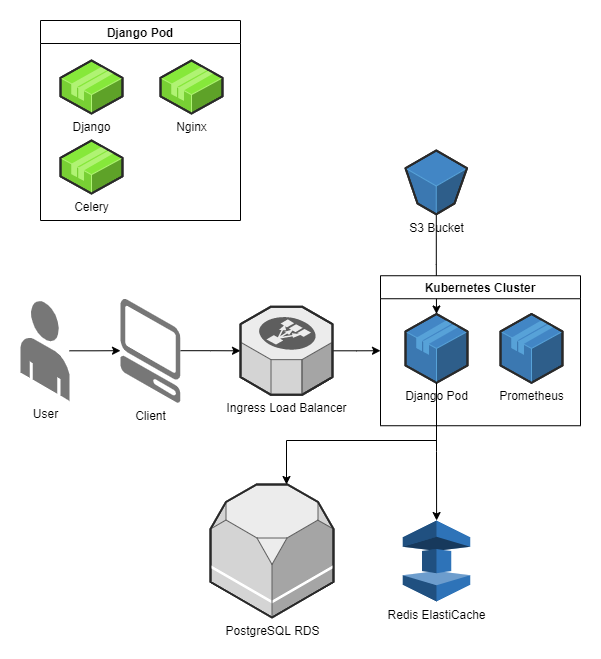

## Funcionalidad

Las principales funcionalidades de la aplicación son las siguientes

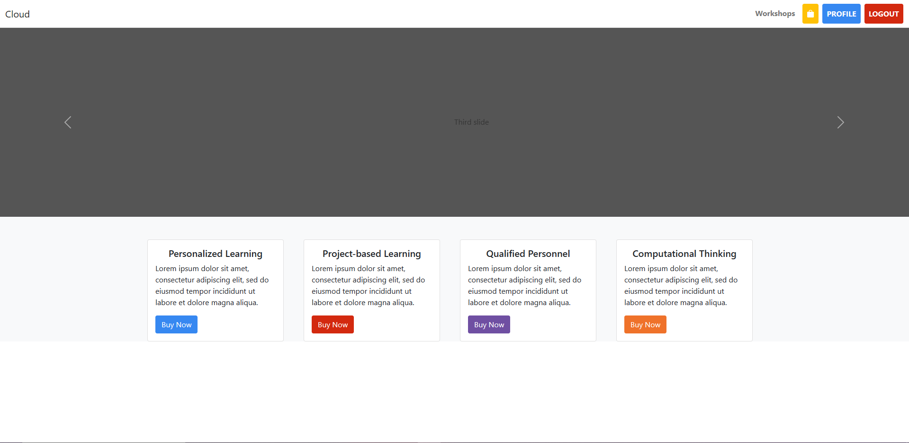

### Registro de usuarios

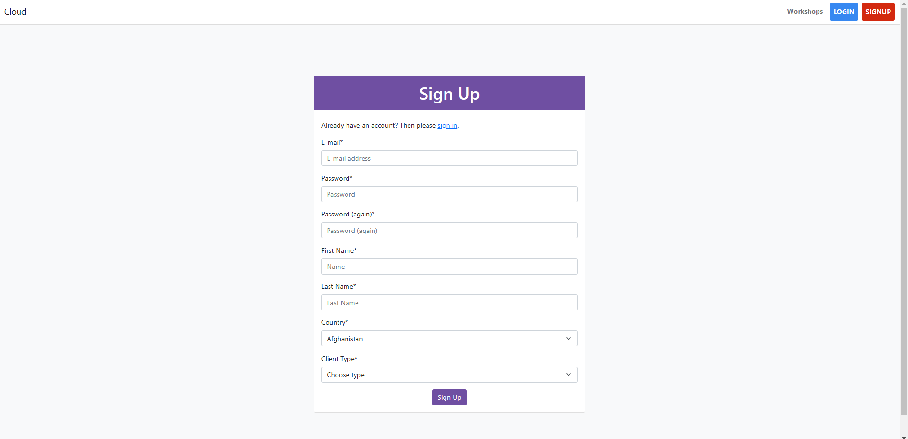

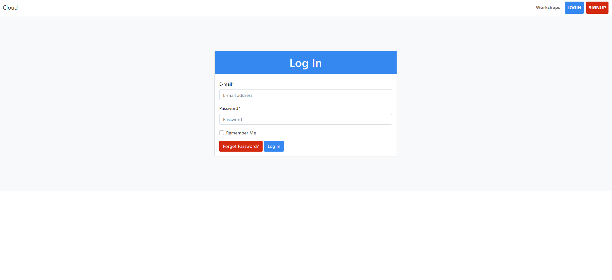

### Creación de estudiantes

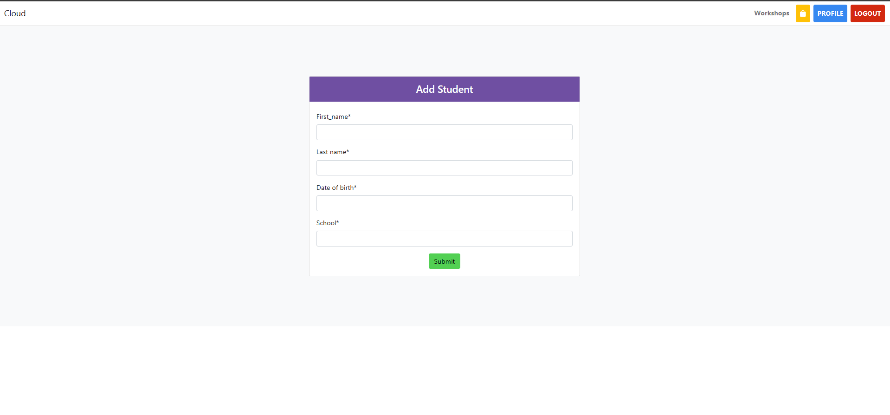

### Compra de talleres

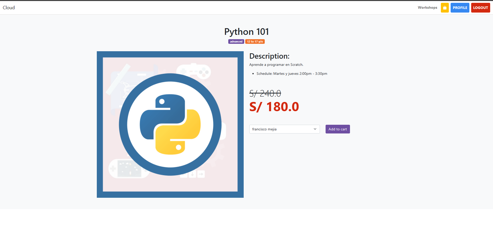

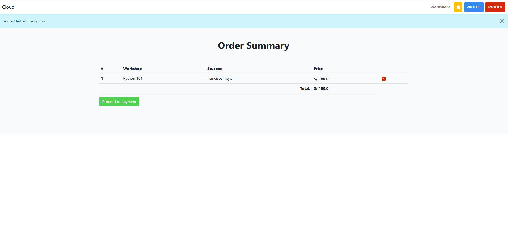

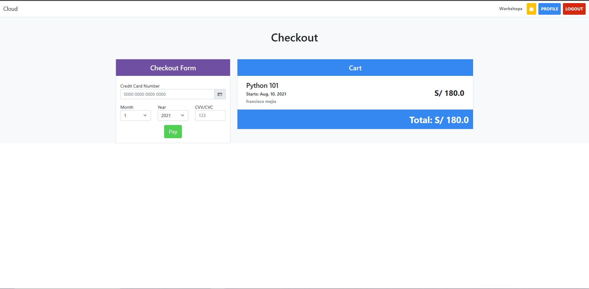

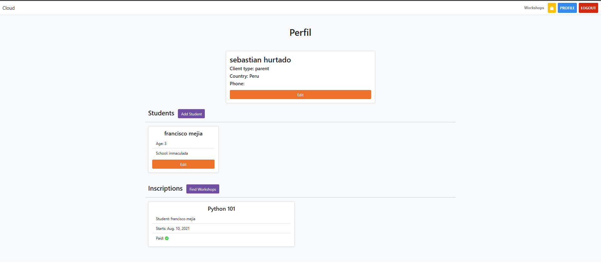

### Creación de talleres

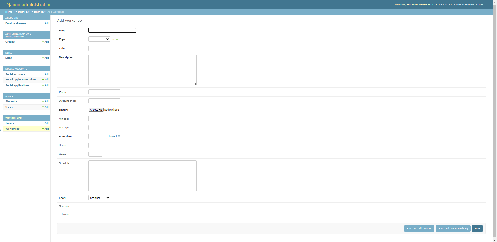

### Dashboard para manipular la base de datos de la aplicación

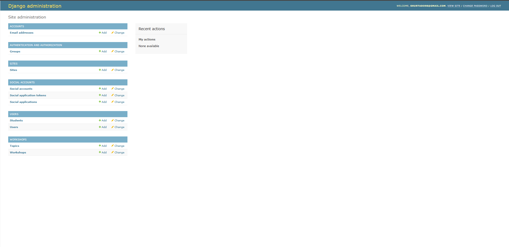

## Motivación

Esta aplicación fue seleccionada principalmente pues los integrantes entienden a fondo los componentes que la integran. Además, tiene una complejidad intermedia y es fácilmente adaptable a las demás necesidades del proyecto, como el procesamientoe de data para analítica. Además de esto, las herramientas con las que fue hecha la aplicación cuentan con suficiente documentación para realizar la migración de los diferentes componentes a kubernetes.

## Conceptos de cloud

- Multicontainer: la aplicación será desplegada en [Kubernetes](docker-compose.yml)
- Procesamiento de datos: la información relacionada a las compras en la aplicación será procesada en paralelo mediante Celery para realizar [analítica](cloud/celery.py). La información será guardada en un modelo especial de la base de datos.
- Modelo de programación en la nube: el procesamiento anterior aprovechará el uso de In Memory Processing para acelerar los resultados de analítica.
- Escalabilidad: mediante las herramientas de administración de Kubernetes, se proporcionarán reglas para garantizar la escalabilidad de la aplicación.
- Testeo y monitoreo: para testear la carga de la aplicación, se utilizará la herramienta [Locust](https://locust.io/), mientras que para el monitoreo se utilizará [Prometheus](https://prometheus.io/)

## Ejecución
- [Local](https://www.loom.com/share/19d5ee2d4f4643d6b8f857b705bef698)
- [Deploy](https://www.loom.com/share/0fcbeabcd06b480a81fd19d9fe280b1a)
